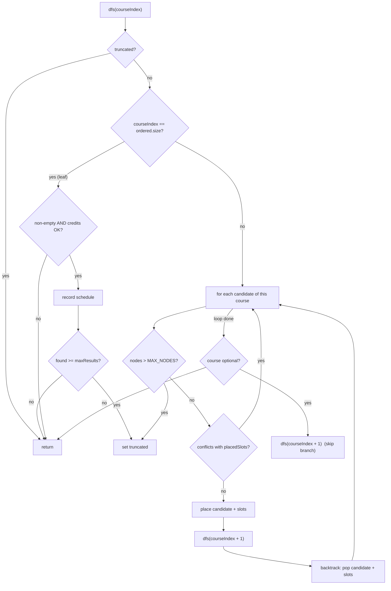

# The Automatic Scheduling Algorithm

This document explains, end to end, how Jupiterp Mobile's automatic schedule
generator is built and how it works. It is **self-contained**: every type and every
piece of the core algorithm is reproduced inline, so you should not need to open any
source file to follow along. Source locations are cited (`path:line`) only for
traceability.

---

## 1. Overview

The generator takes a list of courses a student wants, plus a set of hard constraints
(no classes before 9am, Fridays off, only open sections, …), and returns **every
conflict-free way to pick one section per course**, ranked by whatever the student
cares about (top-rated professors, fewest gaps, fewest days on campus, …).

Key properties:

- **Language / platform:** Kotlin Multiplatform (Compose Multiplatform), shared
  `commonMain` code that runs identically on Android and iOS.
- **Pure and synchronous:** the engine is a stateless `object` (`ScheduleGenerator`)
  with no I/O and no side effects. Callers run it on a background dispatcher
  (`Dispatchers.Default`). Because it is pure, it is trivially testable and
  thread-safe.
- **Bounded:** output is capped at `DEFAULT_MAX_RESULTS = 200` schedules, and the
  search itself is capped at `MAX_NODES = 500_000` explored nodes, so a pathological
  input (e.g. dozens of all-async courses) can never hang the app.
- **Search strategy:** a constraint-filtered **depth-first search with backtracking**
  — effectively a small constraint-satisfaction solver — with *fail-first* variable
  ordering for early pruning.

Core engine file: `composeApp/src/commonMain/kotlin/com/jupiterp/jupiterpmobile/domain/scheduler/ScheduleGenerator.kt`.

---

## 2. End-to-end call flow

The UI layer (`GeneratorViewModel`) orchestrates the call. The relevant part of
`generate()` (`ui/screens/generator/GeneratorViewModel.kt:268`):

```kotlin
fun generate() {
    val requirementList = _requirements.value
    if (requirementList.isEmpty()) return
    val constraints = _constraints.value

    generationJob?.cancel()
    generationJob = viewModelScope.launch {
        _generationState.value = GenerationState.Loading

        // Refetch full section lists; courses captured from a filtered
        // search (e.g. by instructor) may be missing sections
        val courses: List<Course> = courseRepository
            .getCoursesByCodes(requirementList.map { it.courseCode })
            .getOrElse { error ->
                _generationState.value =
                    GenerationState.Failed(error.message ?: "Couldn't load course data")
                return@launch
            }

        val byCode = courses.associateBy { it.courseCode }
        val missing = requirementList.filter { byCode[it.courseCode] == null }
        if (missing.isNotEmpty()) {
            _generationState.value = GenerationState.Failed(
                "Couldn't find: ${missing.joinToString(", ") { it.courseCode }}"
            )
            return@launch
        }
        val requests = requirementList.mapNotNull { item ->
            byCode[item.courseCode]?.let { course -> item.toRequest(course) }
        }

        val instructorNames = requests
            .flatMap { it.course.sections.orEmpty() }
            .flatMap { it.instructors }
        val ratings = courseRepository.getInstructorRatings(instructorNames)

        val result = withContext(Dispatchers.Default) {
            ScheduleGenerator.generate(requests, constraints, ratings)
        }

        if (result.schedules.isNotEmpty()) {
            // With optional courses in play, lead with the fullest schedules.
            if (requests.any { !it.required }) {
                _sortCriterion.value = SortCriterion.MOST_CLASSES
            }
            _generationState.value = GenerationState.Done(
                result.schedules, result.truncated, ratings, result.pinNotices
            )
            return@launch
        }

        // Nothing fits: explain which single constraint to loosen.
        val hints = withContext(Dispatchers.Default) {
            singleRelaxations(constraints).mapNotNull { relaxation ->
                val rerun = ScheduleGenerator.generate(
                    requests, relaxation.constraints, ratings, maxResults = 50
                )
                if (rerun.schedules.isEmpty()) null
                else RelaxationHint(relaxation, rerun.schedules.size, rerun.truncated)
            }
        }
        _generationState.value =
            GenerationState.NoSchedules(hints, result.coursesWithNoValidSections)
    }
}
```

The flow:

1. **Refetch full course data.** A course captured during a filtered search (e.g. "by
   instructor") may carry only a subset of its sections, so the full section lists are
   reloaded by course code.
2. **Build requests.** Each UI requirement becomes a `CourseRequest`, carrying its
   required/optional flag and any pin (a forced section or a forced professor).
3. **Fetch instructor ratings** for every instructor that appears, so schedules can be
   scored and ranked.
4. **Run the engine** on `Dispatchers.Default` (CPU-bound work off the main thread).
5. **Branch on the outcome:**
   - schedules found → `Done` (and, if any course was optional, default the sort to
     "Most classes" so the fullest schedules lead);
   - none found → recompute by relaxing each constraint one at a time and surface
     `NoSchedules` with hints ("allowing Friday classes would give 12 schedules");
   - data error → `Failed`.

`toRequest` maps a UI row to an engine request (`GeneratorViewModel.kt:258`):

```kotlin
private fun RequirementItem.toRequest(course: Course) = CourseRequest(
    course = course,
    required = required,
    pin = when {
        pinnedSectionCode != null -> SectionPin.BySection(pinnedSectionCode)
        pinnedInstructor != null -> SectionPin.ByInstructor(pinnedInstructor)
        else -> SectionPin.None
    }
)
```

---

## 3. Data model

These are the exact types the algorithm consumes and produces.

### 3.1 Course catalog types

From `domain/model/DomainModels.kt`. A **course** owns zero or more **sections**; a
section has one or more **meetings**; an in-person or online-sync meeting has a
**classtime** (days + start/end as fractional hours).

```kotlin
@Serializable
data class Course(
    val courseCode: String,
    val name: String,
    val minCredits: Int,
    val maxCredits: Int?,
    val description: String?,
    val genEds: List<String>?,      // Gen-Ed codes like "DSSP", "DVUP"
    val conditions: List<String>?,  // Prerequisites, corequisites, etc.
    val sections: List<Section>?
)
```

```kotlin
@Serializable
data class Section(
    val courseCode: String,
    val sectionCode: String,
    val instructors: List<String>,
    val meetings: List<ClassMeeting>,
    val openSeats: Int,
    val totalSeats: Int,
    val waitlist: Int,
    val holdfile: Int?
) {
    val isFull: Boolean get() = openSeats <= 0

    /** All time slots for conflict detection. */
    val timeSlots: List<TimeSlot>
        get() = meetings.flatMap { meeting ->
            when (meeting) {
                is ClassMeeting.InPerson -> meeting.classtime.daysList.map { day ->
                    TimeSlot(day, meeting.classtime.start, meeting.classtime.end)
                }
                is ClassMeeting.OnlineSync -> meeting.classtime.daysList.map { day ->
                    TimeSlot(day, meeting.classtime.start, meeting.classtime.end)
                }
                else -> emptyList()   // Async, TBA, Unknown contribute no slots
            }
        }
}
```

The `timeSlots` accessor is the bridge between the catalog model and the scheduler: it
flattens a section's meetings into one `TimeSlot` per (day × meeting). **Only
in-person and online-sync meetings produce slots** — `OnlineAsync`, `TBA`, and
`Unknown` produce none, which is why async classes never conflict with anything (see
§5).

```kotlin
@Serializable
sealed class ClassMeeting {
    @Serializable data class InPerson(val classtime: Classtime, val location: Location) : ClassMeeting()
    @Serializable data class OnlineSync(val classtime: Classtime) : ClassMeeting()
    @Serializable data object OnlineAsync : ClassMeeting()
    @Serializable data object TBA : ClassMeeting()
    @Serializable data object Unknown : ClassMeeting()
}
```

```kotlin
@Serializable
data class Classtime(
    val days: String,    // e.g. "MWF", "TuTh"
    val start: Float,    // fractional hours: 9.5 == 9:30 AM
    val end: Float
) {
    val daysList: List<DayOfWeek> get() = parseDays(days)

    // Two-letter day codes (Tu, Th, Sa, Su) are matched before the
    // single-letter ones so "Th" is never read as "T...H".
    private fun parseDays(days: String): List<DayOfWeek> {
        val result = mutableListOf<DayOfWeek>()
        var i = 0
        while (i < days.length) {
            when {
                days.substring(i).startsWith("Tu", ignoreCase = true) -> { result.add(DayOfWeek.TUESDAY); i += 2 }
                days.substring(i).startsWith("Th", ignoreCase = true) -> { result.add(DayOfWeek.THURSDAY); i += 2 }
                days.substring(i).startsWith("Sa", ignoreCase = true) -> { result.add(DayOfWeek.SATURDAY); i += 2 }
                days.substring(i).startsWith("Su", ignoreCase = true) -> { result.add(DayOfWeek.SUNDAY); i += 2 }
                days.substring(i).startsWith("M", ignoreCase = true)  -> { result.add(DayOfWeek.MONDAY); i += 1 }
                days.substring(i).startsWith("W", ignoreCase = true)  -> { result.add(DayOfWeek.WEDNESDAY); i += 1 }
                days.substring(i).startsWith("F", ignoreCase = true)  -> { result.add(DayOfWeek.FRIDAY); i += 1 }
                else -> i += 1
            }
        }
        return result
    }
}
```

```kotlin
enum class DayOfWeek(val short: String, val full: String, val column: Int) {
    MONDAY("M", "Monday", 0),
    TUESDAY("Tu", "Tuesday", 1),
    WEDNESDAY("W", "Wednesday", 2),
    THURSDAY("Th", "Thursday", 3),
    FRIDAY("F", "Friday", 4),
    SATURDAY("Sa", "Saturday", 5),
    SUNDAY("Su", "Sunday", 6)
}
```

```kotlin
// Float-hours time slot used by the catalog layer.
data class TimeSlot(
    val day: DayOfWeek,
    val start: Float,
    val end: Float
) {
    fun overlaps(other: TimeSlot): Boolean =
        day == other.day && start < other.end && end > other.start
}
```

```kotlin
@Serializable
data class ScheduleSelection(
    val course: Course,
    val section: Section,
    val colorIndex: Int   // stable color assigned per schedule for the UI grid
)
```

> Note: `TimeSlot` (float hours) is the catalog-layer representation. Inside the engine
> these are converted to integer **minutes** (`MinuteSlot`, §5) for exact conflict
> arithmetic.

### 3.2 Scheduler input/output types

From `domain/scheduler/SchedulerModels.kt`.

```kotlin
/** Hard constraints a generated schedule must satisfy. Times are minutes since midnight (9:30 AM = 570). */
data class HardConstraints(
    val earliestStartMinutes: Int? = null,
    val latestEndMinutes: Int? = null,
    val daysOff: Set<DayOfWeek> = emptySet(),
    val onlyOpenSeats: Boolean = true,
    val minGapMinutes: Int = 0,
    val minCredits: Int? = null   // drop schedules whose guaranteed credit total is below this
)
```

```kotlin
/**
 * One course to schedule, plus how strictly to place it.
 * - required courses appear in every schedule; optional ones are included only when they fit.
 * - pin narrows the course to one section or one professor, overriding the per-section filters.
 */
data class CourseRequest(
    val course: Course,
    val required: Boolean = true,
    val pin: SectionPin = SectionPin.None
)

sealed interface SectionPin {
    data object None : SectionPin
    data class BySection(val sectionCode: String) : SectionPin
    data class ByInstructor(val name: String) : SectionPin
}
```

```kotlin
/** Raised when a pinned section was kept despite violating active per-section filters. */
data class PinNotice(
    val courseCode: String,
    val sectionCode: String,
    val overriddenFilters: List<OverriddenFilter>
)

enum class OverriddenFilter { EARLIEST_START, LATEST_END, DAY_OFF, OPEN_SEATS }
```

```kotlin
/** Computed once per schedule so re-sorting never regenerates. Times null when all meetings are async/TBA. */
data class ScheduleMetrics(
    val avgInstructorRating: Float?,
    val ratedSectionCount: Int,
    val sectionCount: Int,
    val minCredits: Int,
    val maxCredits: Int,
    val daysWithClasses: Int,
    val totalGapMinutes: Int,
    val earliestStartMinutes: Int?,
    val latestEndMinutes: Int?,
    val minOpenSeats: Int
)

data class GeneratedSchedule(
    val selections: List<ScheduleSelection>,
    val metrics: ScheduleMetrics
)

data class GenerationResult(
    val schedules: List<GeneratedSchedule>,
    val truncated: Boolean,                          // stopped at result/node cap; more may exist
    val coursesWithNoValidSections: List<String>,    // required courses that made generation impossible
    val pinNotices: List<PinNotice> = emptyList()    // pins forced in despite violating filters
)
```

```kotlin
/** A single constraint loosened from a HardConstraints, used to explain zero-result generations. */
data class Relaxation(
    val kind: RelaxationKind,
    val day: DayOfWeek? = null,
    val constraints: HardConstraints
)

enum class RelaxationKind { EARLIEST_START, LATEST_END, DAY_OFF, OPEN_SEATS, MIN_GAP, MIN_CREDITS }
```

---

## 4. The algorithm, step by step

The whole engine is `object ScheduleGenerator`. Two public overloads exist; the simple
one (all courses required, no pins) just wraps each course in a default `CourseRequest`
and delegates to the full one:

```kotlin
object ScheduleGenerator {

    const val DEFAULT_MAX_RESULTS = 200

    /** Hard cap on explored search nodes so degenerate inputs can't hang the app. */
    private const val MAX_NODES = 500_000

    internal data class MinuteSlot(val day: DayOfWeek, val start: Int, val end: Int) {
        fun conflictsWith(other: MinuteSlot, minGapMinutes: Int): Boolean =
            day == other.day &&
                    start - minGapMinutes < other.end &&
                    end + minGapMinutes > other.start
    }

    private data class Candidate(val course: Course, val section: Section, val slots: List<MinuteSlot>)
    private data class CourseCandidates(val candidates: List<Candidate>, val optional: Boolean)

    @JvmName("generateFromCourses")
    fun generate(
        courses: List<Course>,
        constraints: HardConstraints,
        instructorRatings: Map<String, Float> = emptyMap(),
        maxResults: Int = DEFAULT_MAX_RESULTS
    ): GenerationResult = generate(
        requests = courses.map { CourseRequest(it) },
        constraints = constraints,
        instructorRatings = instructorRatings,
        maxResults = maxResults
    )
```

The full `generate` is the heart of the engine. Read it once, then the stage-by-stage
narration below.

```kotlin
    fun generate(
        requests: List<CourseRequest>,
        constraints: HardConstraints,
        instructorRatings: Map<String, Float> = emptyMap(),
        maxResults: Int = DEFAULT_MAX_RESULTS
    ): GenerationResult {
        val pinNotices = mutableListOf<PinNotice>()

        // STAGE 1 — Pre-filter. Drop sections that violate per-section constraints.
        // This is where most of the search space dies. Pinned courses skip the
        // filter (the pin wins) but report what each pinned section overrode.
        val perCourse: List<Pair<CourseRequest, List<Candidate>>> = requests.map { request ->
            val candidates = pinnedSections(request)
                .map { section -> Candidate(request.course, section, minuteSlots(section)) }
            val kept = if (request.pin == SectionPin.None) {
                candidates.filter { candidatePasses(it, constraints) }
            } else {
                candidates.onEach { candidate ->
                    val overridden = overriddenFilters(candidate, constraints)
                    if (overridden.isNotEmpty()) {
                        pinNotices += PinNotice(
                            request.course.courseCode,
                            candidate.section.sectionCode,
                            overridden
                        )
                    }
                }
            }
            request to kept
        }

        // STAGE 2 — Impossibility check. Only required courses with zero valid
        // sections make generation impossible; optional ones are simply dropped.
        val coursesWithoutSections = perCourse
            .filter { (request, candidates) -> request.required && candidates.isEmpty() }
            .map { (request, _) -> request.course.courseCode }
        if (requests.isEmpty() || coursesWithoutSections.isNotEmpty()) {
            return GenerationResult(
                schedules = emptyList(),
                truncated = false,
                coursesWithNoValidSections = coursesWithoutSections,
                pinNotices = pinNotices.distinct()
            )
        }

        // STAGE 3 — Fail-first ordering. Courses with the fewest candidates go
        // first so dead branches are pruned as early as possible.
        val ordered = perCourse
            .filter { (_, candidates) -> candidates.isNotEmpty() }
            .map { (request, candidates) -> CourseCandidates(candidates, optional = !request.required) }
            .sortedBy { it.candidates.size }

        val found = mutableListOf<List<Candidate>>()
        val chosen = ArrayList<Candidate>(ordered.size)
        val placedSlots = mutableListOf<MinuteSlot>()
        var nodes = 0
        var truncated = false
        val minCredits = constraints.minCredits

        // STAGE 4 — Depth-first search with backtracking.
        fun dfs(courseIndex: Int) {
            if (truncated) return
            if (courseIndex == ordered.size) {
                // Leaf: skip the empty schedule (all optional dropped) and any
                // schedule below the credit floor.
                val creditsOk = minCredits == null || chosen.sumOf { it.course.minCredits } >= minCredits
                if (chosen.isNotEmpty() && creditsOk) {
                    found.add(chosen.toList())
                    if (found.size >= maxResults) truncated = true
                }
                return
            }
            val courseCandidates = ordered[courseIndex]
            for (candidate in courseCandidates.candidates) {
                if (++nodes > MAX_NODES) {
                    truncated = true
                    return
                }
                val conflicts = candidate.slots.any { slot ->
                    placedSlots.any { placed ->
                        slot.conflictsWith(placed, constraints.minGapMinutes)
                    }
                }
                if (conflicts) continue
                chosen.add(candidate)
                placedSlots.addAll(candidate.slots)
                dfs(courseIndex + 1)
                chosen.removeAt(chosen.lastIndex)
                repeat(candidate.slots.size) { placedSlots.removeAt(placedSlots.lastIndex) }
                if (truncated) return
            }
            // Optional courses can be left out. Explore the skip branch AFTER the
            // include branches so fuller schedules are found (and kept on
            // truncation) first.
            if (courseCandidates.optional) {
                dfs(courseIndex + 1)
            }
        }
        dfs(0)

        // STAGE 5 — Present selections in the caller's course order, not search order.
        val orderIndex = requests.withIndex().associate { (i, request) -> request.course.courseCode to i }
        val schedules = found.map { combo ->
            val selections = combo
                .sortedBy { orderIndex[it.course.courseCode] }
                .mapIndexed { i, candidate ->
                    ScheduleSelection(candidate.course, candidate.section, colorIndex = i)
                }
            GeneratedSchedule(selections, computeMetrics(combo, instructorRatings))
        }
        return GenerationResult(schedules, truncated, emptyList(), pinNotices.distinct())
    }
```

### Stage 1 — Pre-filter (and pin handling)

For each course, the candidate sections are first narrowed by the pin, then converted
to `Candidate`s (section + its integer minute slots). The pin selector:

```kotlin
    private fun pinnedSections(request: CourseRequest): List<Section> {
        val sections = request.course.sections.orEmpty()
        return when (val pin = request.pin) {
            SectionPin.None -> sections
            is SectionPin.BySection -> sections.filter { it.sectionCode == pin.sectionCode }
            is SectionPin.ByInstructor -> sections.filter { pin.name in it.instructors }
        }
    }
```

If there is **no pin**, candidates are filtered by `candidatePasses`. If there **is** a
pin, the filter is skipped (the user's explicit choice wins), but each violated filter
is recorded as a `PinNotice` so the UI can warn "this pinned section starts before your
earliest-start preference."

```kotlin
    private fun candidatePasses(candidate: Candidate, constraints: HardConstraints): Boolean {
        if (constraints.onlyOpenSeats && candidate.section.openSeats <= 0) return false
        return candidate.slots.all { slot ->
            slot.day !in constraints.daysOff &&
                    (constraints.earliestStartMinutes == null || slot.start >= constraints.earliestStartMinutes) &&
                    (constraints.latestEndMinutes == null || slot.end <= constraints.latestEndMinutes)
        }
    }

    private fun overriddenFilters(candidate: Candidate, constraints: HardConstraints): List<OverriddenFilter> {
        val result = mutableListOf<OverriddenFilter>()
        if (constraints.onlyOpenSeats && candidate.section.openSeats <= 0) result += OverriddenFilter.OPEN_SEATS
        val earliest = constraints.earliestStartMinutes
        if (earliest != null && candidate.slots.any { it.start < earliest }) result += OverriddenFilter.EARLIEST_START
        val latest = constraints.latestEndMinutes
        if (latest != null && candidate.slots.any { it.end > latest }) result += OverriddenFilter.LATEST_END
        if (candidate.slots.any { it.day in constraints.daysOff }) result += OverriddenFilter.DAY_OFF
        return result
    }
```

The four per-section filters: **open seats**, **day off**, **earliest start**, **latest
end**. (Minimum-gap and minimum-credits are *not* per-section — they only make sense for
a whole schedule, so they are enforced later, in the DFS.)

The float-hours → integer-minutes conversion happens once per section here:

```kotlin
    private fun minuteSlots(section: Section): List<MinuteSlot> =
        section.timeSlots.map { slot ->
            MinuteSlot(
                day = slot.day,
                start = (slot.start * 60).roundToInt(),
                end = (slot.end * 60).roundToInt()
            )
        }
```

### Stage 2 — Impossibility check

If a **required** course has no surviving candidate, no schedule can exist, so the
engine returns early with that course code in `coursesWithNoValidSections` (the UI uses
this to say exactly which course is the blocker). An **optional** course with no
candidates is just dropped.

### Stage 3 — Fail-first ordering

Courses are sorted **ascending by candidate count**. Placing the most-constrained
course first means conflicts are discovered near the top of the tree, where pruning
eliminates the largest subtrees. This is the standard "minimum remaining values"
heuristic and is the single most important performance lever for real inputs.

### Stage 4 — DFS with backtracking

`dfs(courseIndex)` tries each candidate for the current course:

- **Conflict check:** does any of the candidate's slots clash with any already-placed
  slot (respecting `minGapMinutes`)? If so, skip it.
- **Place & recurse:** push the candidate onto `chosen` and its slots onto
  `placedSlots`, recurse to the next course, then **backtrack** by popping exactly what
  was pushed.
- **Leaf:** when every course has been visited, a non-empty schedule meeting the
  `minCredits` floor is recorded. Hitting `maxResults` sets `truncated` and unwinds.
- **Optional skip branch:** an optional course additionally recurses *without* placing
  anything — explored **after** all include branches, so denser schedules are found
  first and survive truncation.
- **Node cap:** every candidate visit increments `nodes`; crossing `MAX_NODES` sets
  `truncated` and stops the search.

`placedSlots` is a flat, mutable list shared across the recursion (push on enter, pop on
exit) — this avoids reallocating a conflict set at every node.

### Stage 5 — Build results

Each found combination is reordered back into the caller's original course order (search
order is scrambled by fail-first), assigned stable `colorIndex` values for the UI grid,
and paired with its precomputed metrics.

### DFS control flow



---

## 5. Conflict detection

All times inside the engine are **integer minutes since midnight** (9:30 AM = 570).
Integers avoid the rounding pitfalls of comparing floating-point hours, and the single
conversion in `minuteSlots` keeps it cheap.

Two slots conflict only when they share a day and their `[start, end)` intervals
overlap once expanded by the required gap:

```kotlin
internal data class MinuteSlot(val day: DayOfWeek, val start: Int, val end: Int) {
    fun conflictsWith(other: MinuteSlot, minGapMinutes: Int): Boolean =
        day == other.day &&
                start - minGapMinutes < other.end &&
                end + minGapMinutes > other.start
}
```

**Gap tolerance, worked through.** Suppose class A ends at 10:00 (600) and class B
starts at 10:15 (615):

| `minGapMinutes` | Test (`A.start − gap < B.end` and `A.end + gap > B.start`) | Conflict? |
|---|---|---|
| 0  | `600 + 0 = 600 > 615`? → false | **No** |
| 15 | `600 + 15 = 615 > 615`? → false | **No** (exactly enough time) |
| 30 | `600 + 30 = 630 > 615`? → true  | **Yes** (not enough buffer) |

So `minGapMinutes` doubles as a "minimum passing period": with a 30-minute requirement,
two back-to-back classes 15 minutes apart are rejected.

**Why async classes never conflict.** `Section.timeSlots` only emits slots for
`InPerson` and `OnlineSync` meetings. `OnlineAsync`, `TBA`, and `Unknown` yield an empty
slot list, so `minuteSlots` is empty, the conflict check has nothing to compare, and
such a section fits into any schedule.

---

## 6. Metrics and ranking

### 6.1 Metrics — computed once per schedule

```kotlin
    private fun computeMetrics(combo: List<Candidate>, ratings: Map<String, Float>): ScheduleMetrics {
        val slots = combo.flatMap { it.slots }
        val slotsByDay = slots.groupBy { it.day }

        // Idle minutes between classes on each day, summed across the week. A
        // running max-end keeps nested or multi-meeting sections from producing
        // negative or double-counted gaps.
        val totalGapMinutes = slotsByDay.values.sumOf { daySlots ->
            val sorted = daySlots.sortedBy { it.start }
            var gap = 0
            var coveredUntil = sorted.first().end
            for (slot in sorted.drop(1)) {
                if (slot.start > coveredUntil) gap += slot.start - coveredUntil
                coveredUntil = max(coveredUntil, slot.end)
            }
            gap
        }

        // A section's rating is the mean of its rated instructors; unrated
        // sections are excluded from the schedule average rather than counted as
        // zero, with ratedSectionCount exposing the coverage.
        val sectionRatings = combo.mapNotNull { candidate ->
            val rated = candidate.section.instructors.mapNotNull { ratings[it] }
            if (rated.isEmpty()) null else rated.sum() / rated.size
        }

        return ScheduleMetrics(
            avgInstructorRating = if (sectionRatings.isEmpty()) null else sectionRatings.sum() / sectionRatings.size,
            ratedSectionCount = sectionRatings.size,
            sectionCount = combo.size,
            minCredits = combo.sumOf { it.course.minCredits },
            maxCredits = combo.sumOf { it.course.maxCredits ?: it.course.minCredits },
            daysWithClasses = slotsByDay.keys.size,
            totalGapMinutes = totalGapMinutes,
            earliestStartMinutes = slots.minOfOrNull { it.start },
            latestEndMinutes = slots.maxOfOrNull { it.end },
            minOpenSeats = combo.minOf { it.section.openSeats }
        )
    }
```

Points worth noting:

- **Gaps** are accumulated per day over time-sorted slots. The `coveredUntil` running
  maximum means overlapping or fully-nested meetings (e.g. a lab inside a lecture
  window) never create negative or double-counted gaps. Every real break counts,
  including short passing periods.
- **Rating** is averaged only over sections that have at least one rated instructor.
  Unrated sections are *excluded*, not scored as zero, so one unrated professor doesn't
  unfairly tank a schedule. `ratedSectionCount` reports the coverage.
- **Time metrics are null** when the schedule has no timed meetings at all (everything
  async) — `minOfOrNull` / `maxOfOrNull` return null on the empty slot list.

Because metrics are computed once and stored on `GeneratedSchedule`, re-sorting is pure
comparator work with **no regeneration**.

### 6.2 Ranking

From `domain/scheduler/ScheduleSorter.kt`:

```kotlin
enum class SortCriterion(val label: String) {
    MOST_CLASSES("Most classes"),
    BEST_RATING("Top rated"),
    MOST_COMPACT("Fewest gaps"),
    FEWEST_DAYS("Fewest days"),
    LATEST_START("Latest start"),
    EARLIEST_END("Earliest finish"),
    MOST_CREDITS("Most credits")
}

fun List<GeneratedSchedule>.sortedByCriterion(criterion: SortCriterion): List<GeneratedSchedule> =
    sortedWith(criterion.comparator())

// Unrated schedules sort below any rated one rather than competing with them.
private fun GeneratedSchedule.ratingOrUnrated(): Float = metrics.avgInstructorRating ?: -1f

private fun SortCriterion.comparator(): Comparator<GeneratedSchedule> = when (this) {
    SortCriterion.MOST_CLASSES ->
        compareByDescending<GeneratedSchedule> { it.metrics.sectionCount }
            .thenByDescending { it.ratingOrUnrated() }
            .thenBy { it.metrics.totalGapMinutes }

    SortCriterion.BEST_RATING ->
        compareByDescending<GeneratedSchedule> { it.ratingOrUnrated() }
            .thenBy { it.metrics.totalGapMinutes }
            .thenBy { it.metrics.daysWithClasses }

    SortCriterion.MOST_COMPACT ->
        compareBy<GeneratedSchedule> { it.metrics.totalGapMinutes }
            .thenBy { it.metrics.daysWithClasses }
            .thenByDescending { it.ratingOrUnrated() }

    SortCriterion.FEWEST_DAYS ->
        compareBy<GeneratedSchedule> { it.metrics.daysWithClasses }
            .thenBy { it.metrics.totalGapMinutes }
            .thenByDescending { it.ratingOrUnrated() }

    SortCriterion.LATEST_START ->
        // No timed meetings at all is the latest possible start.
        compareByDescending<GeneratedSchedule> { it.metrics.earliestStartMinutes ?: Int.MAX_VALUE }
            .thenByDescending { it.ratingOrUnrated() }

    SortCriterion.EARLIEST_END ->
        compareBy<GeneratedSchedule> { it.metrics.latestEndMinutes ?: 0 }
            .thenByDescending { it.ratingOrUnrated() }

    SortCriterion.MOST_CREDITS ->
        compareByDescending<GeneratedSchedule> { it.metrics.maxCredits }
            .thenByDescending { it.metrics.minCredits }
            .thenByDescending { it.ratingOrUnrated() }
}
```

Every criterion has explicit tie-breakers, and `ratingOrUnrated()` maps a missing
rating to `-1f` so unrated schedules always land below rated ones in any rating-aware
comparison. Note the deliberate null handling for untimed schedules: they count as the
*latest* possible start (`Int.MAX_VALUE`) and the *earliest* possible finish (`0`).

---

## 7. Constraint relaxation (zero-result hints)

When nothing fits, the app doesn't just say "no schedules." It loosens **one constraint
at a time** and re-runs the generator to report how many schedules each single change
would unlock.

```kotlin
/** Every constraint set that differs from [constraints] by removing exactly one restriction. */
fun singleRelaxations(constraints: HardConstraints): List<Relaxation> {
    val relaxations = mutableListOf<Relaxation>()
    if (constraints.earliestStartMinutes != null) {
        relaxations += Relaxation(RelaxationKind.EARLIEST_START,
            constraints = constraints.copy(earliestStartMinutes = null))
    }
    if (constraints.latestEndMinutes != null) {
        relaxations += Relaxation(RelaxationKind.LATEST_END,
            constraints = constraints.copy(latestEndMinutes = null))
    }
    for (day in constraints.daysOff) {
        relaxations += Relaxation(RelaxationKind.DAY_OFF, day = day,
            constraints = constraints.copy(daysOff = constraints.daysOff - day))
    }
    if (constraints.onlyOpenSeats) {
        relaxations += Relaxation(RelaxationKind.OPEN_SEATS,
            constraints = constraints.copy(onlyOpenSeats = false))
    }
    if (constraints.minGapMinutes > 0) {
        relaxations += Relaxation(RelaxationKind.MIN_GAP,
            constraints = constraints.copy(minGapMinutes = 0))
    }
    if (constraints.minCredits != null) {
        relaxations += Relaxation(RelaxationKind.MIN_CREDITS,
            constraints = constraints.copy(minCredits = null))
    }
    return relaxations
}
```

The ViewModel (§2) runs the generator once per relaxation (capped at 50 results each,
since it only needs a count), keeps the ones that actually produce schedules, and
surfaces them as `RelaxationHint`s. Tapping a hint (`applyRelaxation`) copies that
loosened `HardConstraints` into state and regenerates. A day off is relaxed
individually, so each blocked day becomes its own actionable suggestion.

---

## 8. Bounds and complexity

- **Result cap** — `DEFAULT_MAX_RESULTS = 200`. On the 200th schedule the search sets
  `truncated = true` and unwinds. The UI shows "truncated" so the user knows more exist.
- **Node cap** — `MAX_NODES = 500_000`. Counts candidate visits, not just leaves;
  crossing it stops the search with `truncated = true`. This guards against
  combinatorial blowups (e.g. many all-async courses, where nothing ever conflicts and
  the full product would be explored).
- **Time complexity** — worst case O(P^C) for C courses with up to P candidate sections
  each (e.g. 6 courses × 6 sections = 6⁶ = 46,656 combinations before pruning). In
  practice, conflict pruning plus fail-first ordering collapses this dramatically; the
  caps bound the rest.
- **Per-node cost** — the conflict check is O(slots_of_candidate × placedSlots). Both
  are small (a handful of meetings × a few courses).
- **Space** — recursion depth C, plus `placedSlots` proportional to total meetings in
  the in-progress schedule, plus the found-results list (≤ 200 combinations).

`truncated` therefore means: *"a cap was hit; more valid schedules may exist beyond what
was returned."* It is never set by a normal, fully-explored search.

---

## 9. Worked example

Three required courses, default constraints (`onlyOpenSeats = true`, no time window, no
days off, `minGapMinutes = 0`):

| Course | Sections (day/time) | Open seats |
|---|---|---|
| **AAA101** | `S1` MWF 09:00–09:50 | 5 |
| **BBB200** | `S1` MWF 09:00–09:50 · `S2` MWF 11:00–11:50 | 5 / 5 |
| **CCC300** | `S1` TuTh 10:00–11:15 · `S2` (online async) | 5 / 5 |

**Stage 1 (filter):** all sections have open seats and no time/day limits apply → all
survive. Slots become minutes, e.g. AAA101·S1 → `{(MON,540,590),(WED,540,590),(FRI,540,590)}`.
CCC300·S2 is async → **no slots**.

**Stage 3 (fail-first):** candidate counts are AAA101=1, BBB200=2, CCC300=2 → search
order **AAA101, BBB200, CCC300**.

**Stage 4 (DFS):**
- Place AAA101·S1 (MWF 9:00).
- Try BBB200·S1 (MWF 9:00) → **conflict** with AAA101 on Mon/Wed/Fri at 540 → pruned.
- Try BBB200·S2 (MWF 11:00) → no conflict → place it.
  - Try CCC300·S1 (TuTh 10:00) → different days, no conflict → leaf #1.
  - Try CCC300·S2 (async, no slots) → never conflicts → leaf #2.

Two schedules result:

1. AAA101·S1 + BBB200·S2 + CCC300·S1
2. AAA101·S1 + BBB200·S2 + CCC300·S2 (async)

**Stage 5 / metrics:** schedule 1 has classes on Mon/Tue/Wed/Thu/Fri →
`daysWithClasses = 5`, with a gap Mon/Wed/Fri between 9:50 and 11:00 (70 min each day)
plus the Tu/Th class. Schedule 2 has timed classes only MWF → `daysWithClasses = 3`,
and `totalGapMinutes` of 3 × 70 = 210 (9:50→11:00 each of MWF; the async section adds no
slots). Under **Fewest days** schedule 2 ranks first; under **Most compact** the one
with fewer total gap minutes wins.

---

## 10. Design decisions and invariants

- **Pins override filters, transparently.** An explicit section/professor pin bypasses
  the per-section filters, but every override is reported as a `PinNotice` so the user
  is never silently given something they said they didn't want.
- **Async/TBA never conflict.** Driven entirely by `Section.timeSlots` emitting no slots
  for untimed meetings — no special-casing in the search.
- **Integer minutes.** All conflict and gap math is on integers; floats only exist at
  the catalog boundary, converted once.
- **Metrics precomputed.** Sorting and re-sorting never touch the generator; switching
  criteria is instant.
- **Optional skip branch goes last.** Include-branches are explored before the
  skip-branch so fuller schedules are discovered first and are the ones retained when
  truncation kicks in. The ViewModel reinforces this by defaulting the sort to "Most
  classes" whenever optional courses are present.
- **Fail-first ordering** is what keeps real-world inputs fast; the two caps keep
  worst-case inputs safe.
- **Pure function.** No I/O, no shared mutable state across calls — safe to run on any
  dispatcher and easy to unit-test deterministically.

---

## 11. Testing

The behavior above is locked in by `composeApp/src/commonTest/kotlin/com/jupiterp/jupiterpmobile/ScheduleGeneratorTest.kt`,
which builds small in-memory courses/sections and asserts the engine's output. Coverage
includes, among others:

- **Conflict & ordering** — `excludesConflictingCombinations`,
  `selectionsFollowRequestedCourseOrder`.
- **Filters** — `onlyOpenSeatsFiltersFullSections`, `timeWindowFiltersSections`,
  `daysOffFilterSections`, `minGapTreatsBackToBackAsConflict`, `asyncSectionsAlwaysFit`.
- **Bounds** — `truncatesAtMaxResults`.
- **Optional courses** — `optionalCourseIsDroppedWhenItConflicts`,
  `optionalCourseGeneratesEverySubset`,
  `requiredCourseWithNoSectionsStillBlocksWhileOptionalDoesNot`.
- **Pins** — `pinBySectionRestrictsToThatSection`,
  `pinByInstructorKeepsOnlyThatProfessorsSections`,
  `pinWinsOverFilterAndReportsTheOverride`.
- **Credits** — `minCreditsExcludesTooLightSchedules`, `minCreditsListedAsRelaxation`.
- **Metrics** — `computesMetrics`, `gapCountsBreaksWithinAndAcrossCourses`,
  `countsShortPassingPeriods`, `singleMeetingDayHasNoGap`,
  `untimedScheduleHasNullTimeMetrics`.
- **Relaxations** — `listsOneRelaxationPerActiveConstraint`,
  `noRelaxationsForUnconstrainedInput`.
- **Sorting** — `mostClassesSortsBySectionCountDescending`,
  `bestRatingSortsDescendingWithUnratedLast`, `mostCompactSortsByGapMinutes`,
  `latestStartPutsUntimedFirst`.

Run the shared test suite with the Gradle test task for the common/JVM target, e.g.:

```bash
./gradlew :composeApp:allTests        # all KMP targets
# or, faster during development:
./gradlew :composeApp:jvmTest         # if a JVM test target is configured
```

---

## Appendix — File map

| Concern | File |
|---|---|
| Core engine (`generate`, `dfs`, conflict, metrics) | `composeApp/src/commonMain/kotlin/com/jupiterp/jupiterpmobile/domain/scheduler/ScheduleGenerator.kt` |
| Inputs/outputs & relaxations | `.../domain/scheduler/SchedulerModels.kt` |
| Ranking comparators | `.../domain/scheduler/ScheduleSorter.kt` |
| Catalog domain models | `.../domain/model/DomainModels.kt` |
| UI orchestration | `.../ui/screens/generator/GeneratorViewModel.kt` |
| Tests | `composeApp/src/commonTest/kotlin/com/jupiterp/jupiterpmobile/ScheduleGeneratorTest.kt` |
